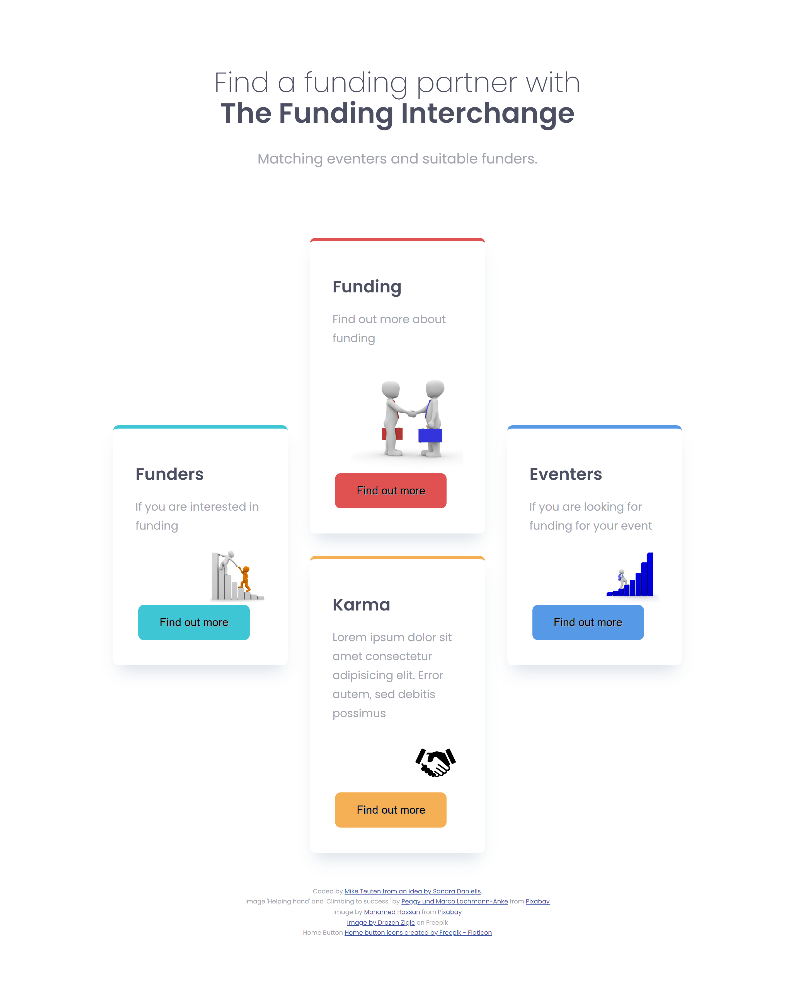

# The funding interchange

## Table of contents

- [Overview](#overview)
  - [The challenge](#the-challenge)
  - [Screenshot](#screenshot)
  - [Links](#links)
  - [Built with](#built-with)
  - [Useful resources](#useful-resources)
  - [Author](#author)
  - [Acknowledgments](#acknowledgments)

## Overview

This site is intended to bring together people and organisations needing funding for their project and those people and organisations with funds available to support events.

### The challenge

Users should be able to:

- View the optimal layout for the site depending on their device's screen size and navigate the site easily. The aim is to have the site make good matches between funding organisations and those seeking funds. We also aim to use AI to help those seking funds to compose a letter to be submitted to the matching funders based on the replies in their questionaires.

### Screenshot

### 

### 

### Links

- Live Site URL: 

### Built with

- Semantic HTML5 markup
- CSS custom properties
- Flexbox
- CSS Grid
- Mobile-first workflow

### Useful resources

- [Kevin Powell Media](https://www.kevinpowell.co/) - Many good tips on using CSS and getting the best out of it. Explained simply and comprehensively.

## Author

- Mike Teuten

## Acknowledgments

Climbing to success. Image by Peggy und Marco Lachmann-Anke from Pixabay

("<https://pixabay.com/users/peggy_marco-1553824/?utm_source=link-attribution&utm_medium=referral&utm_campaign=image&utm_content=1020163>")

("<https://pixabay.com//?utm_source=link-attribution&utm_medium=referral&utm_campaign=image&utm_content=1020163>")
_________________________________________________
